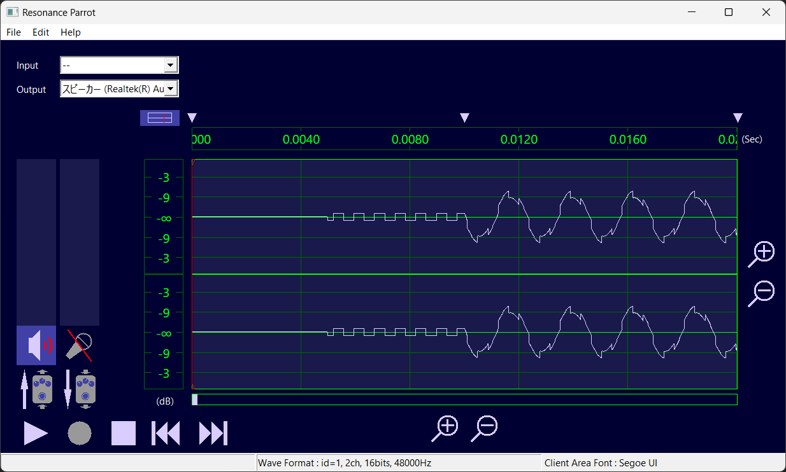

# sample_wav_maker
A CLI application that makes wav files with superimposed basic waveforms. It can superpose sine waves, triangle waves and square waves with various parameter.
Only for 64bit OS.

## Caution
\* Misconfigurarions or bugs may generate unexpected waveforms. So be careful with the volume when playing.

\* 設定ミスやバグによって予想外の波形が生成されることがあります。再生時は音量に気をつけましょう。

## Build
```
cargo build --release
```
You can find `sample_wav_maker(.exe)` in `./target/release/` directory.

## Default Setting
If you do not set options, the following values are set.

### Default of Wav File
* Wave Format
    * Format id: 1 (PCM)
    * Channel: 1 (Monoral)
    * Sampling rate: 16000Hz
    * Bits per sample: 16

* Wave Length
    * 1.0 seconds

* Path
    * Output File: "./new.wav"

### Default of Wave Shape
* Wave Shape Kind: Sine wave
* Frequency: 440.0 (Hz)
* Phase: 0.0 * PI (rad)
* Amplitude: -3.0 (dB)
* Span: equal to "Default of Wave Length"

## Usage of Command Line Arguments
*I'm developing and testing in Windows. If you are using another OS, please change following commands accordingly.
* `<n>`: natural number (decimal)
* `<f>`: natural number or number with a decimal point (decimal)
### Make new file
```
sample_wav_maker.exe new [--out "file"] [--format <n(format id)> <n(channel)> <n(sampling rate)> <n(bits per sample)>] [--seclen <f> | --numlen <n>] [--sin | --tri | --square] [--amp <f> ] [--freq <f>] [--secspan <f> <f> | --framespan <n>  <n>] [--piphase <f>]
```
#### Example
*Copy the executable file to any folder.
```
sample_wav_maker.exe new --out sin.wav --format 1 2 48000 16 --seclen 2.0 --sin --amp -4 --freq 440.0 --secspan 0.01  1.6 --piphase 1.0
```
A sine wave starts at 0.01sec


### Add wave to a existing file
```
sample_wav_maker.exe addwave --in "file" [--out "file"| --ow] [--sin | --tri | --square] [--amp <f> ] [--freq <f>] [--secspan <f> <f> | --framespan <n>  <n>] [--piphase <f>]
```
#### Example
*Run following command after "Make new file"'s example. 
```
sample_wav_maker.exe addwave --in sin.wav --out sin_square.wav --square --amp -12 --freq 1318.5 --secspan 0.005  1.0 --piphase 1.5
```
A square wave starts at 0.005seconds. and it is added on the a sine wave.




### Arguments about Format and File Length
You can only set the following options to "new".
#### `--format <n> <n> <n> <n>`
* 1st argument: format id
    * `n = 1 (PCM) or 3 (IEEE float)`
    * If you select 3, bits per sample is forced to 32.
* 2nd argument: channel
    * `n = 1 (Monoral) or 2 (Stereo)`
* 3rd argument: sampling rate (Hz)
    * `n = 8000, 16000, 32000, 48000, 96000, 192000, 22050 or 44100`
* 4th argument: bits per sample
    * `n = 8, 16, 24 or 32`
    * If you select 3 for format id (IEEE float), bits per sample must be set to 32.
    * If you select 1 for format id (PCM), audio data is as follows:
        * 8 : Unsigned 8bit PCM
        * 16, 24, 32 : Signed 16,24,32bit PCM

#### `--seclen <f>`
* Change file length (seconds)
* f range : `0.0 <= f && f <= (4,294,967,249 / (bits per sample * channel * sampling rate)).floor()`
* You can only set either "--seclen" or "--framenum".

#### `--framenum <n>`
* Change file length (number of audio data frame).
* n range : `0 <= n && n <= (4,294,967,249 / (bits per sample * channel)`
* You can only set either "--seclen" or "--framenum".

### Arguments about File Path
#### `--in "file"`
* Input from "file" as source waves.
* You have to set this option when "addwave". And you can not set this to "new".

#### `--out "file"`
* Output to "file"
* If the "file" exists, you will be asked that you want to overwrite it or not.
* You can set only one of "--out", "--outf" or "--ow".

#### `--outf "file"`
* Forced output to "file".
* If the "file" exists, it will be overwritten.
* You can set only one of "--out", "--outf" or "--ow".

#### `--ow`
* Overwrite to "--in" file.
* You can set only one of "--out", "--outf" or "--ow".
* You can only set this option to "addwave".


### Arguments about Wave Shape
#### `--sin`
* Change wave shape to sine wave from default.
* You can set only one of "--sin", "--tri" or "--square".

#### `--tri`
* Change wave shape to triangle wave from default.
* You can set only one of "--sin", "--tri" or "--square".

#### `--square`
* Change wave shape to square wave from default.
* You can set only one of "--sin", "--tri" or "--square".

#### `--amp <f>`
* Change amplitude (dB) from default.
* f range : `-100.0 <= f && f <= 100.0`

#### `--freq <f>`
* Change frequency (Hz) from default.
* f range : `0.0 <= f`

#### `--secspan <f> <f>`
* Change wave span (seconds) from default.
* first arguments is start seconds, and second one is end seconds
* f range : `0.0 <= f && f <= (4,294,967,249 / (bits per sample * channel * sampling rate)).floor()`
* You can only set either "--secspan" or "--framespan".

#### `--framespan <n> <n>`
* Change wave span (index of audio data frame) from default.
* first arguments is start frame index, and second one is end frame index
* n range : `0 <= n && n <= (4,294,967,249 / (bits per sample * channel)`
* You can only set either "--secspan" or "--framespan".

#### `--piphase <f>`
* Change phase when span starts (PI * rad) from default.
* f range : `0.0 <= f && f < 2.0`


